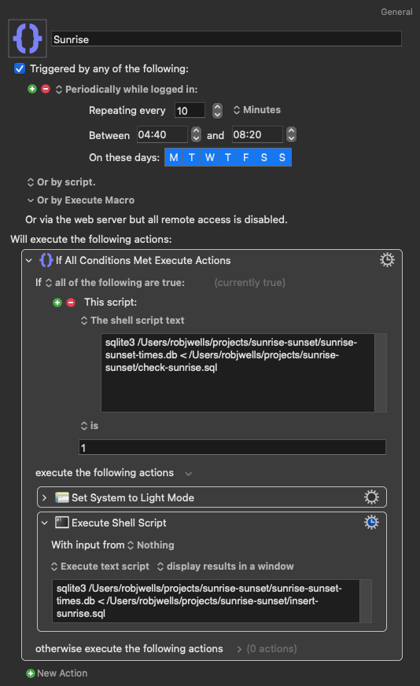

A while ago, I was having trouble with the automatic light-dark theme switching on my laptop, as macOS tries to wait until an opportune moment when the computer is idle to make the change. That's fair enough, as it does involve a moment when the system is not responsive. I was finding that if I kept working it would often be quite a while after sunset that the switch occurred.

[Keyboard Maestro can set the system light-dark theme][km], so I thought I'd rig it up to periodically check whether sunrise or sunset had occurred, and then force the change rather than being polite. There's a trade off but overall I prefer the automatic switching to take place closer to the sunrise or sunset time rather than the system waiting in an attempt not to inconvenience me briefly.

[km]: https://wiki.keyboardmaestro.com/action/Set_System_to_Dark_Mode

It relies on a local SQLite database of sunrise and sunset times for my home, but when I first rigged it up, I "only" put in the times for 2021 and 2022. It's now time to fill the database for the coming years, so what better time to have a peek at how it works?

[You can find the git repository here][repo].

[repo]: https://github.com/robjwells/sunrise-sunset

First off, we need a data source. I didn't include a scraper in repo originally, partly out of politeness, but partly also because I hoped to change the data source.

In the UK, [HM Nautical Almanac Office][nao] (NAO) publishes various rise, set and twilight times (for other celestial objects as well as the sun). After a few [false][nao-day] [starts][nao-map] trying to find a big list of daily rise and set times for a long period at a time, you'll come across the [WebSurf 2.0][nao-ws] application, which reassuringly has `.cgi` in the URL (and, naturally, you would hope is entirely written in Perl).

But after clicking your way through, you’ll end up with a big plain-text listing with no markup (here, snipped horizontally and vertically):

```
    2023 Sunrise and Sunset times


         January       February

       Rise   Set     Rise   Set
       h  m   h  m    h  m   h  m
  1   08 06  16 02   07 39  16 50
  2   08 06  16 03   07 38  16 51
  3   08 06  16 04   07 36  16 53
  4   08 06  16 05   07 35  16 55
  5   08 06  16 07   07 33  16 57
```

Now while this is not impossible to deal with, and I of course hear [Jerusalem][] when thinking about the public servants who went through the trouble of making this data available, at the end of the day I am, in the words of the Tories, a shirker rather than a striver. So let's find an easier way! (Also one that works for people outside Britain.)

Thankfully, ~~[whattimeisitrightnow.com][wt]~~ [timeanddate.com][td] has us covered. Search for your preferred location and go to the "Sun and Moon" ▸ "Sunrise & Sunset" view. You'll end up with something like `timeanddate.com/sun/uk/london`.

[wt]: https://www.whattimeisitrightnow.com/
[td]: https://www.timeanddate.com/sun/uk/london

That will show you the rise and set times for the current month, but if you play with the dropdown above the table, you may notice that picking a different month or year is as simple as adding parameters to the URL, like so:

```bash
"https://www.timeanddate.com/sun/uk/london?month=${month}&year=${year}"
```

Thankfully, too, this data is in the HTML that gets served up, with no JavaScript-dependent front-end framework or scraper-blocker in the way. That leads us naturally onto this simple shell script:

```bash
seq 2023 2030 | while read year; do
    seq 1 12 | while read month; do
        curl --silent \
            "https://www.timeanddate.com/sun/uk/london?month=${month}&year=${year}" \
            > "sunrise-${year}-${month}.html"
    done
done
```

This just dumps each month from 2023 through 2030 into an individual HTML file in the current directory. From there we turn to [`process_html_tables.py`][py]. This is pretty straightforward and broken up into nice small parts, so you can read that at your leisure. It leans on Pandas to parse the HTML tables from the downloaded files and Pendulum to correctly handle dates with timezones, but there's not much too it. Do check that you're using the right timezone, though.

[nao]: http://astro.ukho.gov.uk/
[nao-day]: http://astro.ukho.gov.uk/nao/miscellanea/birs2.html
[nao-map]: http://astro.ukho.gov.uk/nao/miscellanea/UK_SRSS/uk_dec.html
[nao-ws]: http://astro.ukho.gov.uk/surfbin/runsurf_beta.cgi
[Jerusalem]: https://www.youtube.com/watch?v=sERiPuOQyvo
[py]: https://github.com/robjwells/sunrise-sunset/blob/main/process_html_tables.py

Running that Python file will process all the scraped HTML files in the folder, and print an array of JSON objects, each containing a date, sunrise datetime and sunset datetime. This is an intermediate step that isn't strictly necessary, but you might want that data available in a plain-text file.

But it also means it's trivial to create a SQLite database file with [`sqlite-utils`][sqlu]:

```bash
python3 process_html_tables.py | sqlite-utils insert sunrise-sunset.db london -
```

[sqlu]: https://sqlite-utils.datasette.io/en/stable/

That will create the "london" (in this case) table for you, but there's also an SQL file to create both the table for the sunrise and sunset times and also one to log successful checks (`create-tables.sql`):

```sql
CREATE TABLE london (
    date text primary key,
    sunrise text not null,
    sunset text not null
);
CREATE TABLE successful_checks (
    date text not null references london(date),
    kind text not null,
    primary key (kind, date),
    check (kind in ('sunrise', 'sunset'))
);
```

This second table exists so that you can have, say, Keyboard Maestro automatically switch between light and dark modes, but also not have it override any manual change you make after that within the check period (for instance, if it's a cloudy day and you want to keep dark mode on, so you manually re-enable it).

Here's `check-sunrise.sql` (`check-sunset.sql` is similar):

```sql
select
    time('now') >= time(sunrise) as "sun has risen"
from
    london
where
    date = date('now')
    and not exists (
        select
            date
        from
            successful_checks
        where
            kind = 'sunrise'
            and date = date('now')
    )
;
```

Note that it only returns true (well, 1) if there hasn't already been a successful (ie one causing a change) sunrise check today.

A fair question is: "Why keep checking if you've already passed sunrise or sunset?" And the answer is: mostly so I don't have to worry about the procedure for disabling and enabling the relevant Keyboard Maestro macros. Instead, I can have the macro run at a set interval between the earliest and latest sunrise/sunset times, and be confident it won't change anything if it's already run successfully. Here's the sunrise macro itself:



As a convenience, there's an SQL script in the repo to find when these times are from the database file.

One other convenience is a LaunchBar action that shows duration between the current time and today's sunrise and sunset:

<video src="launchbar-sunrise-sunset.mp4">

You'll have to create the actual action yourself through LaunchBar's Action Editor, but the file [`launchbar-sunrise-sunset.sh`][lb] can be pasted in to the default shell script in a new action, with of course the database file path and table names adjusted.

[lb]: https://github.com/robjwells/sunrise-sunset/blob/main/launchbar-sunrise-sunset.sh
