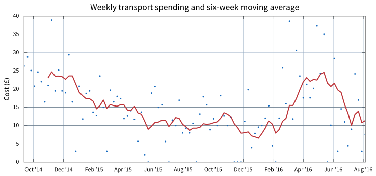

title: 700 days on the train
date: 
draft

If you register your Oyster card, you can get [Transport for London][tfl] to send you a summary of your recent journey history, as either a PDF or a CSV file. I ignored it for years after I moved here because I couldn’t work out the use but decided in 2014 to keep a record of my own travel. I had nothing in particular in mind at the time, but I thought: “CSV! I can crunch the numbers at some point!”

Well, it’s been almost two years and I’ve amassed 100 weeks of travel logs. As I’ve just had to move it’s an appropriate time to look back, particularly as I now live just a short cycle from work and so won’t take the train.

In that time I’ve spent £1,481.15 on Oyster fares. The plot below shows what that looks like week by week.

    

The two horizontal bars at £15 and £10 are what I would spend a week on commuting without and with a [railcard discount][railcard]. You can see that the average clings to that roughly at periods.

[railcard]: http://www.railcard.co.uk

The choice of a six-week moving average is somewhat arbitrary but does make reveal a couple of things: higher spending in late 2014 on non-work journeys (long trips that crossed fare zone 1), applying the railcard discount in spring 2015, and losing that discount at the start of 2016.

But really my commuting costs were so low (zone 4 to 3, off-peak) that an extra return journey into central London could cause a spike.

One thing that surprised me was the split between rail and bus. Even over such an extended period, I only made *21 bus journeys*. In contrast I made *915 by rail*. In fact, over half of those journeys (12) were made between midnight and 4am — saved by the night bus after the trains stop running.
